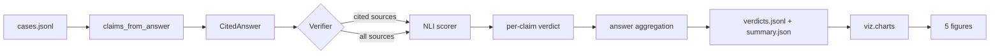

# lcg — legal citation grounder

A verifier loop that takes a legal answer with inline citations like

> Non-compete agreements are not enforceable in California under section 16600 [s1].

decomposes it into claims, looks up the cited sources, and runs an NLI head to
check whether the cited source actually entails the claim. Anything that no
source supports (cited or otherwise) gets flagged as a likely hallucination.

The point is a post-hoc safety net: even if your retriever + generator combine
to produce a fluent answer with a citation that looks right, the verifier
catches the cases where the citation does not actually back the text.

## What's in here

```
src/lcg/
  types.py                       Source, Claim, CitedAnswer, ClaimVerdict, AnswerVerdict
  claims/decompose.py            sentence + [sid] decomposition (no nltk dep)
  nli/scorer.py                  DeBERTa-MNLI head; HeuristicNLI fallback (Jaccard)
  verifier/check.py              the verifier loop + per-answer aggregation
  viz/charts.py                  five distinct chart types
  cli/main.py                    typer: verify, report, plots
```

## Methodology

For each claim in the answer:

1. **NLI(claim, cited sources).** Take the max entailment probability over the
   claim's cited sources. If this is below threshold (default 0.5), the cite
   does not actually back the claim.
2. **NLI(claim, all sources).** Same thing over every retrieved source. If at
   least one source entails the claim even though it is not cited, we know the
   information is in the corpus but the wrong source got linked.
3. **Flag.** A claim is flagged iff neither (1) nor (2) supports it.

Aggregated per answer:

- **citation_precision** = fraction of claims with at least one citation that
  the cited source(s) actually back.
- **citation_recall** = fraction of claims that have any supporting cited source
  (out of all claims that need support).
- **hallucination_rate** = fraction of claims that no source supports.

This split matters: a high recall + low precision answer is doing the
"shotgun citation" thing (cite-everything, hope-something-sticks). A high
precision + low recall answer is the opposite (the citations are right when
they appear, but most claims lack any citation).

The NLI head defaults to ``MoritzLaurer/DeBERTa-v3-base-mnli-fever-anli`` (184M
DeBERTa-v3 fine-tuned on MNLI + FEVER + ANLI). A heuristic Jaccard fallback is
included so the suite runs without downloading the model in CI.

## Quickstart

```bash
make install
make verify DATA=tests/fixtures/cases.jsonl PROVIDER=heuristic
make plots
```

The fixture has 5 cases: clean cites, miscited claim that is rescued by another
source, pure hallucination, multi-citation, and an exceptions clause. Each is
short enough to verify by hand.

## Metrics

Different metric vocabulary from project #4 (retrieval) and project #5 (RAG eval):

| metric              | what it measures                                            |
|---------------------|-------------------------------------------------------------|
| citation_precision  | of the cited sources, how many actually entail the claim?   |
| citation_recall     | of the claims, how many have at least one supporting cite?  |
| hallucination_rate  | fraction of claims no source supports                       |
| per-claim entailment| max NLI probability across cited sources                    |
| flagged             | binary: claim has no cited or non-cited supporter           |

## Results

> Pending the first verifier run on the in-repo fixture (5 hand-crafted cases).
> The harness is verified by 13 unit tests covering sentence split, citation
> parsing, the verifier outcomes for clean / bad-cite-but-rescued / pure
> hallucination / empty-answer cases, and the heuristic NLI bounds.

| qid | citation_precision | citation_recall | hallucination_rate |
|-----|-------------------:|----------------:|-------------------:|
| c1  |                TBD |             TBD |                TBD |
| c2  |                TBD |             TBD |                TBD |
| c3  |                TBD |             TBD |                TBD |
| c4  |                TBD |             TBD |                TBD |
| c5  |                TBD |             TBD |                TBD |

## Visualizations

Five charts, each answering a different question about citation behavior:

1. **Per-answer claim outcomes** (stacked horizontal bar): cited-and-supported
   vs supported-by-non-cited vs flagged.
2. **Entailment heatmap** (claim x source): which sources back which claims,
   per answer.
3. **Hallucination-rate trend** (line): how the flag rate moves across runs.
4. **Per-answer precision vs recall scatter**: each point is one answer,
   colored by its hallucination rate.
5. **Verifier vs human confusion matrix**: when you've labeled some claims by
   hand, this tells you whether the verifier's flag is calibrated.

## Architecture



## Known limitations

- Sentence-level claims only; for long-form answers FActScore-style atomic-fact
  decomposition (one sentence -> N facts) is the right call. Not implemented yet.
- The NLI head defaults to ``DeBERTa-MNLI``, which was not trained on legal text.
  Out-of-domain entailment is noisier than in-domain; treat the probabilities
  as ordinal rankings, not calibrated.
- Verifier vs human comparison requires hand-labeled data; the chart degrades
  gracefully when none is supplied.
- Threshold = 0.5 is a starting point. The optimal threshold depends on how much
  you weight precision vs recall and should be swept on a held-out set.

## What's next

- [ ] Atomic-fact decomposition with an LLM (FActScore-style) for long-form.
- [ ] Per-domain NLI fine-tune on Legal-MNLI when one is available.
- [ ] A small calibration script: pick the threshold that maximizes F1 on a
      held-out labeled set.
- [ ] Cross-source consistency check (do the cited sources agree with each
      other?).

## References

- Bohnet, B., et al. (2023). *Attributable Language Models: Reducing Hallucination
  by Citing Sources.* arXiv:2305.14908.
- Min, S., et al. (2023). *FActScore: Fine-grained Atomic Evaluation of Factual
  Precision in Long Form Text Generation.* EMNLP.
- Zheng, L., et al. (2021). *CaseHOLD: A Dataset for Multiple Choice Legal
  Question Answering.* ICAIL.
- Laurer, M., et al. (2024). *DeBERTa-MNLI fine-tunes.* HuggingFace model card.

## License

MIT.


## Documentation and test artifacts

- Long-form research report: [`docs/research_report.pdf`](./docs/research_report.pdf) (rendered) and [`docs/_report/research_report.md`](./docs/_report/research_report.md) (markdown source). Regenerate the PDF with `make pdf` (requires `pandoc` + `xelatex`).
- Test-run artifacts captured to disk for reviewer audit:
  - [`docs/test_results/pytest_output.txt`](./docs/test_results/pytest_output.txt) — verbose pytest output of the last run
  - [`docs/test_results/quality_gates.txt`](./docs/test_results/quality_gates.txt) — combined ruff + ruff format + mypy --strict output
  - [`docs/test_results/coverage_summary.txt`](./docs/test_results/coverage_summary.txt) — pytest-cov summary
- Regenerate with `make test-artifacts`.

